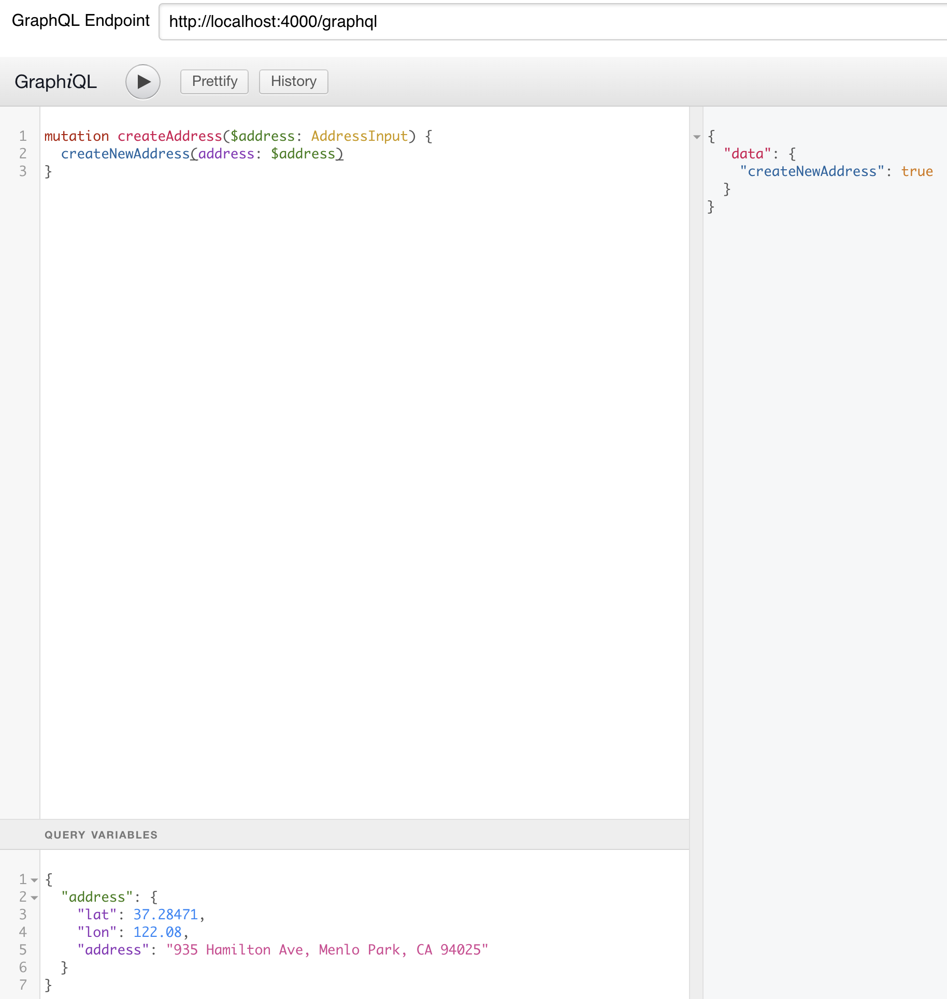
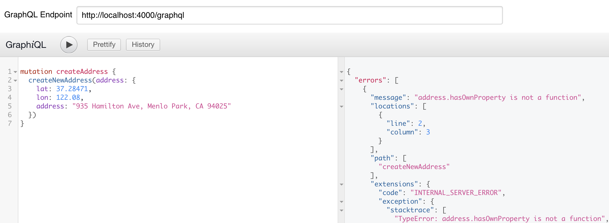

# Apollo Server Bug

When working with GraphQL input objects in a mutation, my team at work uncovered some strange behavior. An engineer who built a GraphQL mutation that creates an address was relying on query variables to satisfy the GraphQL Input Object, however another engineer kept receiveing a cryptic error message whenever he attempted to satisfy that same GraphQL Input Object by _manually_ typing it as a query param.

## Steps to reproduce

Inside this simple Apollo Express Server project the input object is being pulled from the resolver args and there's a simple attempt to call an `Object.prototype` method on the input object. This attempt will fail if you manually create the Input Object but it will succeed if you create that Input Object using a query variable.

This works:



This does _not_ work:



## Why it matters

Our team is ~unfortunate~ lucky enough to have to work with Firebase on a day-in/day-out basis, which means we are leveraging their NodeJs client to create new records in our remote Firebase collections. It routinely invokes an Object's `.hasOwnProperty()` method, and so we frequently run into that error when we're calling a `.update()` on a collection with nested objects. Until today we've been making separate calls to retrieve the existing Firebase record and manually merging it over the input object.

## What this bug resembles

Whenever one invoks a `Object.create(null)` in JavaScript you end up with an Object that will essentially have _only_ the key/value pairs you explicitly set.  You _won't_ get any prototype methods and therfore you can't invoke a `Object.keys()`, an `Object.hasOwnProperty()` or anything else that requires you inherity from the `Object` prototype.

This bug seems very similar to what you would expect if you did this:

```js
const address = Object.create(null)
address.lat: 37.28471
address.lon: 122.08
// This line will throw an error
console.log(address.hasOwnProperty(lat))
```

And of course this will _not_ throw an error:

```js
const address = {}
address.lat: 37.28471
address.lon: 122.08
console.log(address.hasOwnProperty(lat))
```

So it seems that there is _something_ about using query variables that does _not_ cause Apollo/GraphQL under-the-hood to treat it like a dictionary. However if you manually set the values in the query params it ends up creating a prototype-less dictionary that just kills some of the NodeJS client libraries for ORMs.
